#Ruby on Rails
<h3>Criando uma aplicação em 12 minutos</h3>https://www.youtube.com/watch?v=cVsdbbW39eM

<hr>

Aplicação capaz de registrar os **Aliens**, qual **planeta eles vivem** e quais são os seus **poderes** 

Antes verificar se está tudo OK

* **Ruby** `ruby -v`
* **Gems** (gerenciador de pacotes) `gem -v`
Checar lista de pacotes `gem list`

<i>Checar se o **Sqlite** está instalado se não estiver instalar
`gem install sqlite3 -v '1.4.1' --source 'https://rubygems.org/'`</i>

* **Rails** `rails -v` ou instalar o **Rails** 
`gem install rails`

Para gerar a base do projeto `rails new spacerails`

Utilizar o <i>Scaffold-Generator</i> pra dar start no módulo de áreas
`rails g scaffold Alien name:string age:integer`

No primeiro momento definir que o **Alien** vai ter um **nome** e uma **idade** 

Utilizar o `rake db:migrate` para gerar a tabela no banco.

Em seguida iniciar o servidor local de desenvolvimento `rails s`
Acessando no navegador **LocalHost** na porta **3000**
`http://localhost:3000/`
aparecerá a tela de boas-Vindas do Rails.

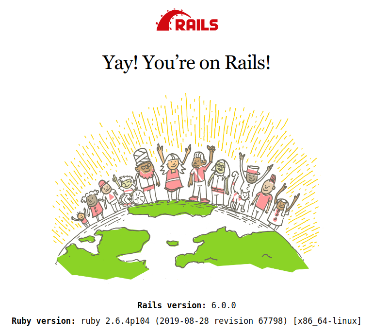
Colocar `/aliens` após no final endereço na barra de navegação pra acessar o módulo recém criado.
`http://localhost:3000/aliens`

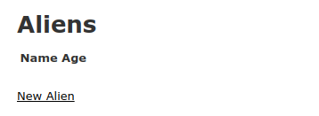

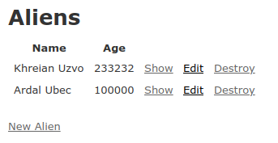

Como padrão o <i>Scaffold</i> gerou 
o necessário pra realizar o **CRUD** <i>(acrónimo do inglês Create, Read, Update and Delete)</i> do Banco de dados.
> Sugestão de nomes de aliens a serem criados:
> * Ardal Ubec 100000 age
> * Khreian Uzvo 233232 age
> * Oledaa Ascho 166644 age
> * Oledaa Sascho 12234 age

Após isso sair do servidor `Ctrl+C`e criar o **Módulo de Planetas**  sendo que este terá um atributo **nome** 
`rails g scaffold Planet name:string`
`rake db:migrate` para gerar a tabela.

Entrar novamente no servidor `rails s` 
`http://localhost:3000/planets`
da mesma forma anterior cadastrar os planetas.
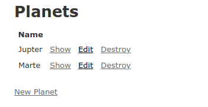

Agora criar os **Poderes** para mais tarde atribuir aos **Aliens**
`rails g scaffold Power name:string`
`rake db:migrate`
`rails s`
`http://localhost:3000/powers`

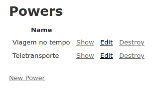

Então um **Alien** pertence a um **Planeta** e possui um ou mais **Poderes** 
Para criar os relacionamentos começar adicionando uma referência de **Planetas** aos **Aliens**

> <i>IMPORTANTE antes disso é deixar o **banco de dados VAZIO**, antes de cirar os relacionamentos...</i>

`rails g migration AddPlanetToAlien planet:references`
rodar `rake db:migrate` para atualizar o banco e reinicializar o sevidor local `rails s`

Precisamos dizer no módulo que **Aliens** pertence a um **Planeta**.

Para isso em `/spacerails/app/models/alien.rb`


```
class Alien < ApplicationRecord
  belongs_to :planet
end
```
Precisamos criar o campo para fazer o relacionamento de **Alien** em **Planet** 
`/spacerails/app/views/aliens/_form.html.erb`

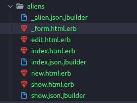

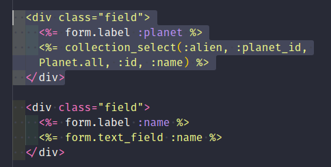
```
  <div class="field">
    <%= form.label :planet %>
    <%= collection_select(:alien, :planet_id, Planet.all, :id, :name) %>
  </div>
```
Por conta da segurança do Rails precisamos colocar esse **atributo** em uma **white list** para permitir que ele seja salvo.
`/spacerails/app/controllers/aliens_controller.rb`

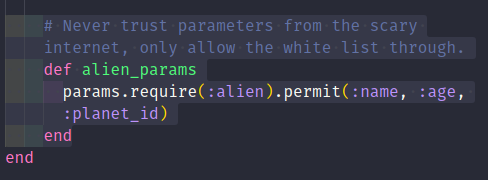

```
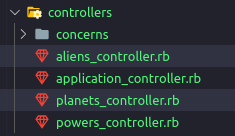
    # Never trust parameters from the scary internet, only allow the white list through.
    def alien_params
      params.require(:alien).permit(:name, :age, :planet_id)
    end
```
Agora acrescentar na lista de **Aliens** seus respectivos planetas.
`/spacerails/app/views/aliens/index.html.erb`

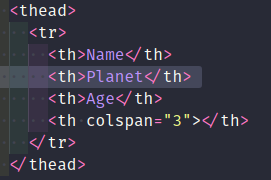


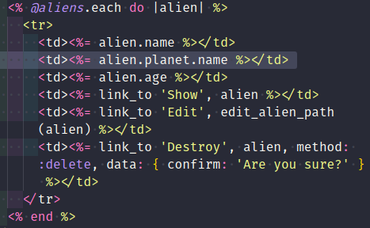
```
<table>
  <thead>
    <tr>
      <th>Name</th>
      <th>Planet</th>
      <th>Age</th>
      <th colspan="3"></th>
    </tr>
  </thead>

  <tbody>
    <% @aliens.each do |alien| %>
      <tr>
        <td><%= alien.name %></td>
        <td><%= alien.planet.name %></td>
        <td><%= alien.age %></td>
        <td><%= link_to 'Show', alien %></td>
        <td><%= link_to 'Edit', edit_alien_path(alien) %></td>
        <td><%= link_to 'Destroy', alien, method: :delete, data: { confirm: 'Are you sure?' } %></td>
      </tr>
    <% end %>
  </tbody>
</table>
```
Como um **Alien** pode ter vários **Poderes** precisa criar um módulo para definir esses relacionamentos.
`rails g model AlienPower alien:references power:references`
atualizar o banco e iniciar o servidor
`rake db:migrate`
`rails s`

É preciso dizer ao **Rails** que o **Alien** possui diversos **Poderes** assim em 
`/spacerails/app/models/alien_power.rb`
```
class AlienPower < ApplicationRecord
  belongs_to :alien
  belongs_to :power
end
```
como em
`/spacerails/app/models/alien.rb`
```
class Alien < ApplicationRecord
  belongs_to :planet

  has_many :alien_powers
  has_many :powers, through: :alien_powers

end
```
e
`/spacerails/app/models/power.rb`
```
class Power < ApplicationRecord

  has_many :alien_powers
  has_many :aliens, through: :alien_powers

end
```
Para finalizar adicionar os poderes no formulario de **Aliens**.
```
  <div class="field">
    <%= form.label :powers %>
    <%= collection_check_boxes(:alien, :power_ids, Power.all, :id, :name) %>
  </div>
```

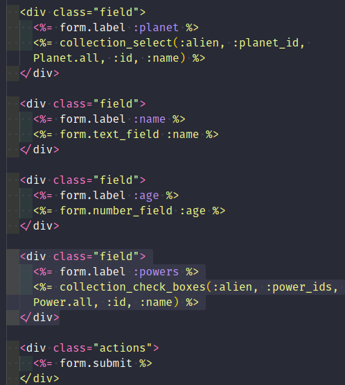
em
`/spacerails/app/controllers/aliens_controller.rb`
```
# Never trust parameters from the scary internet, only allow the white list through.
    def alien_params
      params.require(:alien).permit(:name, :age, :planet_id, :power_ids => [])
    end
```

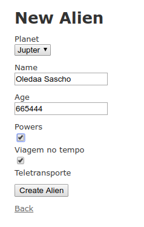

Para evitar que um **Alien** seja salvo sem **nome** acrescentar uma regra de validação.
`/spacerails/app/models/alien.rb`
```
class Alien < ApplicationRecord
  belongs_to :planet

  has_many :alien_powers
  has_many :powers, through: :alien_powers

  validates_presence_of :name

end
```
E para finalizar criar a estilização lo Layout, em:
`/spacerails/app/assets/stylesheets`
criar o arquivo `style.css` e configurar como achar melhor.

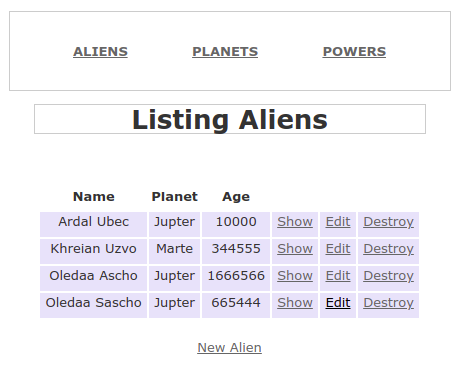

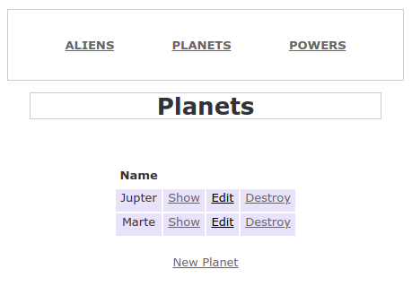

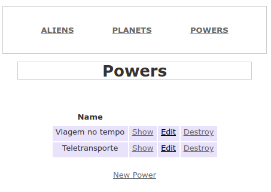
